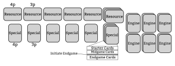

  Victory Point Salad

Objective {#objective}
=========

  Spend veeps to get veeps. Got it.

The objective of this game is to get the most victory points.

You will get victory points by playing cards, but to play the good cards you'll need other cards first.

Setup
=====

Like most board games, the setup looks much harder than it actually is. We just need to be detailed for you noobs.

1. Separate all cards into piles by their backs.
2. Separate each **Engine card** by its name and place each Engine in its own face-up pile.
3. Place **Ladder** cards face-up where everyone can easily see them.
4. Place one player color cubes at the bottom of each **Ladder**.

Prefer starting off with analysis paralysis? Try our Drafting Variant.

3. Shuffle all **Resource Cards** and place them in a pile face down.
4. **Draw 3 Resource cards** for each player and place them face-up on their Tableau.
5. Give each player one **Blocker** card and place face-up in their Tableau.
6. Shuffle the **Endgame** cards face-down. This pile will be known as the *Special Pile*.
7. Place the **Initiate Endgame** card face-down on top of the Special Pile.
8. Shuffle the **Midgame** cards and place them face-down on top of the Special Pile.
9.  Shuffle the **Starter pile** and place face-down on top of the Special Pile.
10. Distribute **3 Starter Cards** to the *Hands* of each player.
11. Populate the **Purchase Rows**. For the Resources Pile and the Special Pile each, draw 3/4/5 cards for 2/3/4 players. Place these cards face-up in a row next to the pile, as shown.
12. Decide who **goes first**. We suggest the person who most recently won a game with Victory Points. Place *The Coveted Starting Player* on that player's Tableau.

  

The Table
=========

Ah, the magical hand limit of 5.

You will have a **Hand** of Special cards. In your Hand, you are limited to having 5 cards by the end of your turn. At any time, you may **Trash** a card from your Hand. Place Trashed cards back in the box.

You won't get extra veeps for having a well-organized tableau.

Or will you??

Your **Tableau** is the array of already-played, face-up cards in front of you. You may have an unlimited number of cards on your Tableau. You may *not* Trash a card on your Tableau, unless you play another card that allows you to. You may arrange your Tableau however you wish, but you must allow your opponents see any of your Tableau cards upon request.

The Cards
=========

These are usually little cubes or meeples, but this is a cheap game.

   

**Resource Cards** cards provide the raw materials for you to build your Tableau. Some may have a Description, but all will have one or two **Resources**.

These games have not advanced past a medieval society.

This game has the following Resources: Wood, Clay, Stone, Sheep, Wild Boar, Cattle, Grain, Carrot, Glass, Gold, Silk, and Food. Resource cards may not be exchanged, e.g. you may *not* "make change". Some Resource cards have descriptions that allow extra abilities to be done with the Resource(s) on the card.

Every card is special. Every. Card.

All other types of cards are **Specials**, denoted by their portrait orientation. This game has the following types of Specials:

  * **Engines** are always available for purchase
  * **Blockers** have negative effects on your Tableau that must get rid of
  * **Starters** are Specials that could be in your starting hand, potentially, and you will see early game.
  * **Midgames** are Specials that will appear after gameplay has gone past the Starters.
  * **Endgames** are Specials that you will see at the very end of the game.

  
    
  
  
    
  

<!-- 

 -->

Specials can have the following:

  * **Resource**. These are raw materials that the Special provides.
  * **Trash Requirement**: To play this card from your hand, you must trash the noted Resource from your Tableau. This resource may be a Resource card or Special - as long as it has the Resource(s) you need.
  * **Power**. This card, when on your Tableau, will have a permanent power you may use.
  * **Requires Power**: To play this card from your hand, you must have the denoted Power on your Tableau (e.g. Building, Military)
  * **Description**: This text may have special rules about the card.
  * **Victory Points** : This is how much the card is worth at the end of the game, if it's in your Tableau.

Gameplay
========

Gameplay is done in **Rounds**. In a given Round, the player with the *The Coveted Starting Player* card on their tableau takes the first turn. Play continues to the left.

On your turn, you get two **actions**. A given action can be one of the following:

* **Take an available Resource card** and place directly on your Tableau
* **Take an available Special** and place in your Hand. Prerequisites are not enforced for this action.
* **Play a Special card** from your Hand, trashing the necessary Resources and satisfying any prerequisites of the Special. Place the card face-up on your tableau. *The Chain Rule* applies to this (see below).
* **Steal the _The Coveted Starting Player_** by trashing a card from your Tableau. *The Chain Rule* applies to this (see below).

Remember, if your Hand contains more than 5 cards, you must trash your Hand down to 5 before the end of your turn.

This is an evil rule right here.

At any time, and without taking an action, you may Trash a card from your Hand without costing an action.

**_The Chain Rule_**. There is a special case where you may play multiple Specials for one action. If, upon playing a Special card, you have leftover Resources on the cards involved, you may play another Special using that resource. This can continue as long as you have leftover resources.

> Suppose you have three Resource Cards: Wood+Clay, Stone, and Sheep. You play Special that requires a Clay, but now there's 1 Wood left over. So you play a second Special that requires Wood and Stone, using up your Stone card. This counts as one Action. With no more leftover Resources in the chain, the Sheep must be part of a separate transaction.

**_Immediate Effects_** Any abilities or resources granted by playing a card take effect immediately when played, even in the middle of a chain.

Stealing the *The Coveted Starting Player* may be part of a chain rule that was initiated by placing a Special, and vice-versa.

> Suppose you have a Wood+Clay card, and you play a Special that requires Clay. With your leftover Wood, you may steal *The Coveted Starting Player*.

**Substitutions**. Some bonuses allow you to replace one resource with another when Trashing. These substitutions can be limited per-turn, or unlimited. These substitutions may *only* be made as part of a Trash move in playing another card.

> For example, you have played *The Grain Engine*. Later, you can play *Sheep Breed!*, by trashing a Grain instead of a Sheep.

**Ladders**. When a card says that you may "Climb" a ladder, move your cube up one level on the Ladder card of your choice. For *The Point Ladder*, points are scored non-cumulatively at the *end* of the game. For *The Resource Ladder*, take your bonus immediately. A *Draw* means that you draw a face-down card from the Resource pile. A *Take* means you may take a face-up Resource card from the purchase rows.

**At the end of the round**, replenish the purchase area with new cards in the following manner:

  * If someone took at *least one card* from a given row, Trash the left-most card, shift the cards to the left and draw cards until the row is full.
  * If *nobody* took a card from a given row, Trash the *two* left-most cards, then shift the cards to the left and draw cards until the row is full.

Endgame
=======

The Endgame phase starts immediately when the *Initiate Endgame* card drawn. Give the *Initiate Endgame* card to the player with *The Coveted Starting Player* to denote that they started Endgame.

All players get their final chance to resolve their Blocker cards.
If any players cannot remove their Blocker (i.e. they cannot trash enough Food), then the Blocker stays on their Tableau through the end of the game.

Remove all available Resource cards, Engine cards, and Midgame cards from the purchase rows. Place *all* Endgame cards face-up in a grid (order does not matter).

Play starts with "The Coveted Starting Player" and continues to the left. Each player gets *two actions* per turn during Endgame.

At any time, the current player may declare "Game Over". Once Game Over is declared, players continue to take turns until every player has had the same number of Endgame turns. That is, continue turns until you reach the owner of the Initiate Endgame card. This may or may not be the player with *The Coveted Starting Player* card (if the card has moved during the phase).

  With this many veeps, ties are rare right?

Add up the points on your Tableau to determine the winner. In the case of a tie, you share the victory.

Solo Campaign Variant
=====================

  To play this game by yourself, you must first accept your own loneliness.

To play this game by yourself, take in 4 Resource and 4 Specials into your hand to start. Purchase rows have 3 cards available each for Resources and Specials. Take 2 Blockers instead of 1.

During the Payoff phase, you only have 4 actions (two "turns").

Your goal at the end of the game is to reach 250 points. At the end of each game, if you reached this goal, then you may keep any number of cards on your tableau that collectively are worth whatever exceeded your game goal. Your second game goal is 280, then 300.

Analysis Paralysis Variant
===================================

  Real gamers know how to shop for the best deals.

During setup, deal out 3 Specials to each player face-down. Select a card to start with in your hand and pass the rest to your left. Continue in this fashion until all of the drafted cards are selected. Then, do the same with 3 Resources to each player.

Lunchbreak Rules
================

  Real gamers know how to shop for the best deals.

For a
